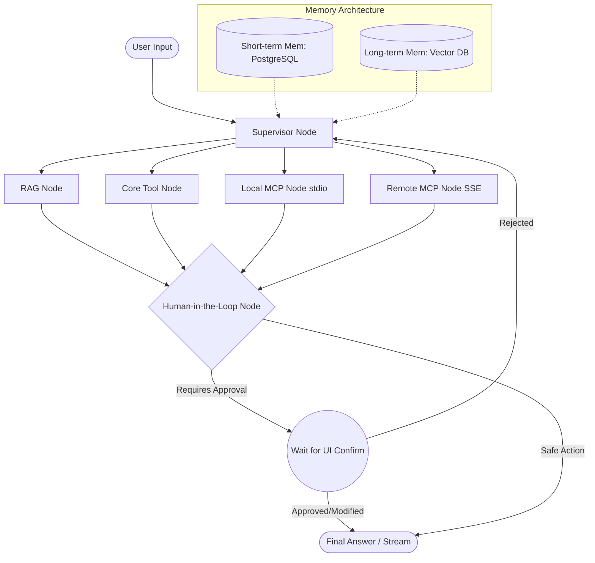

# CORE - Professional Grade Enterprise Chatbot

CORE is a state-of-the-art, multi-tenant agentic chatbot built on a modern AI stack. It utilizes a Supervisor/Router pattern driven by LangGraph, enabling dynamic tool usage, seamless memory management, Human-in-the-Loop (HITL) safety, and unparalleled extensibility through the Model Context Protocol (MCP).

## 🏗 System Architecture

The foundation of CORE is a unified LangGraph state machine rather than a monolithic agent. This allows for explicit routing, predictable state management, and deterministic interruptions for safety.



## ✨ Core Features & Capabilities

* **Multi-Tenant Memory Architecture:**
  * **Short-Term (Episodic):** LangGraph checkpointer (PostgreSQL) manages conversation threads statefully, allowing multi-turn context.
  * **Long-Term (Semantic):** Background processes extract facts and preferences (using tools like Mem0), stored in a user-specific Vector DB, and injected into the Supervisor prompt.
* **Model Context Protocol (MCP) Integration:**
  * **Built-in Servers:** Default native tools like GitHub repo exploration and SQLite schema introspection.
  * **Dynamic Plug-and-Play:** Support for user-defined external MCP servers (via SSE) bound dynamically per session at runtime.
* **Human-in-the-Loop (HITL) Guardrails:**
  * Graph interrupts before executing state-changing or sensitive actions (e.g., database writes). Renders a UI modal for the user to approve, modify, or reject the JSON payload.
* **Enterprise Grade Observability:**
  * Fully integrated tracing via LangSmith/Langfuse to monitor node execution times, exact tool inputs/outputs, and LLM behavior.
* **Robust Tool Error Handling:**
  * Graph nodes implement `try/except` wrappers. Tool failures return structured errors to the LLM for self-correction rather than crashing the pipeline.

## 📁 Folder Structure

```text
core/
├── backend/                # FastAPI application
│   ├── app/
│   │   ├── api/            # API endpoints (REST, WebSockets/SSE)
│   │   ├── core/           # Configuration, security, logging
│   │   ├── graph/          # LangGraph implementation (Nodes, Edges, State)
│   │   ├── tools/          # Native tools and MCP bindings
│   │   └── memory/         # PostgreSQL checkpoints, Mem0 integration
│   ├── main.py             # FastAPI entry point
│   └── requirements.txt
└── frontend/               # React application
    ├── src/
    │   ├── components/     # UI Components (Chat, Modals, Sidebars)
    │   ├── hooks/          # React hooks for WebSockets, State
    │   ├── lib/            # Utilities, API clients
    │   └── app/            # Next.js or Vite routing
    ├── package.json
    └── tailwind.config.js
```

## 🛠 Technology Stack

* **Backend:** FastAPI (Python), LangGraph, LangChain
* **Frontend:** React, Next.js (WebSockets / Server-Sent Events for bi-directional streaming)
* **Database & Memory:** PostgreSQL (Session/Checkpointing), ChromaDB / PGVector (Vector Store), Mem0
* **Extensibility:** MCP Python SDK (Model Context Protocol)
* **Observability:** LangSmith / Langfuse

---

## 🚀 Development Roadmap (6 Phases)

### Phase 1: Foundation & Core RAG Pipeline
* **Goal:** Establish the basic API, LangGraph agent state, and asynchronous document ingestion.
* **Key Tasks:**
  * Initialize FastAPI and define LangGraph `AgentState`.
  * Build an asynchronous document ingestion API (PDF/TXT) using background tasks.
  * Implement text splitting and storing in a local Vector DB with `user_id` metadata filtering for multi-tenancy.
  * Create the RAG Node to format context strings and generate answers.

### Phase 2: Memory Architecture (Short & Long-Term)
* **Goal:** Implement context awareness across single sessions and lifetime usage.
* **Key Tasks:**
  * Integrate LangGraph Checkpointer (`AsyncPostgresSaver`) using `thread_id` for short-term memory.
  * Implement context-window management (message trimming) to prevent hitting LLM token limits.
  * Deploy a background pipeline (or Mem0) to extract semantic takeaways ("User prefers Python") and store them in the user profile.

### Phase 3: Tool Integration & Supervisor Routing
* **Goal:** Transition from a single RAG chain to a multi-capable agent router.
* **Key Tasks:**
  * Build the Supervisor router node to evaluate queries and route paths.
  * Define native `@tool` decorators (e.g., Web Search, Calculator) with robust `try/except` fallbacks.
  * Implement a Tool Execution Node to parse LLM tool calls and append `ToolMessage` results.
  * Integrate Tracing (LangSmith/Langfuse) to monitor tool routing.

### Phase 4: Model Context Protocol (MCP) Integration
* **Goal:** Standardize extensibility by allowing the agent to use external MCP servers.
* **Key Tasks:**
  * Integrate the `mcp` Python SDK.
  * Spin up default standard MCP servers (e.g., GitHub, SQLite) and map them to LangGraph tools.
  * Build an endpoint `POST /api/mcp/register` allowing users to securely connect Remote MCP endpoints (via SSE URLs) and bind them dynamically per session.

### Phase 5: Human-in-the-Loop (HITL) Guardrails
* **Goal:** Ensure safe execution of side-effect-producing tools.
* **Key Tasks:**
  * Identify sensitive tools and configure LangGraph's native `interrupt()` feature.
  * Build endpoints to expose `pending_approval` state and tool payloads.
  * Implement a `POST /api/chat/resume` endpoint using LangGraph `Command(resume=...)` to handle user decisions.
  * Implement timeouts to gracefully abort hanging graphs.

### Phase 6: Frontend Integration & Polish
* **Goal:** Build the user-facing interface to expose all backend capabilities.
* **Key Tasks:**
  * Develop a responsive React dashboard.
  * Implement a WebSocket or SSE connection for streaming LLM tokens AND graph state updates simultaneously.
  * Build Sidebar 1 for drag-and-drop async document ingestion.
  * Build Sidebar 2 for managing dynamic MCP extensions.
  * Create the interactive HITL modal to review, edit, and approve pending tool actions.
